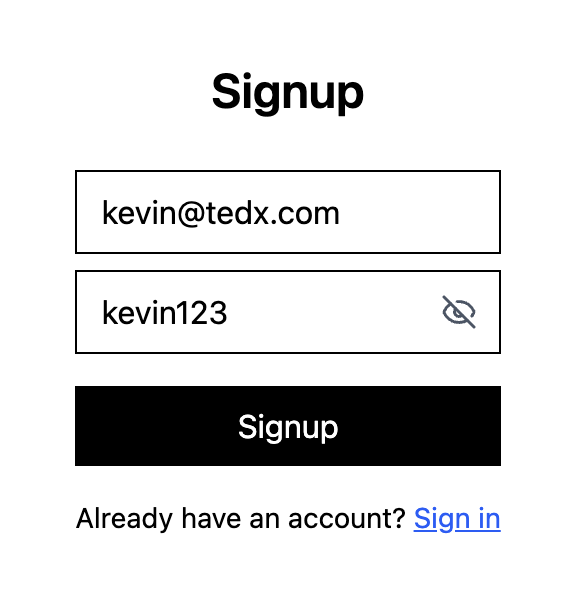
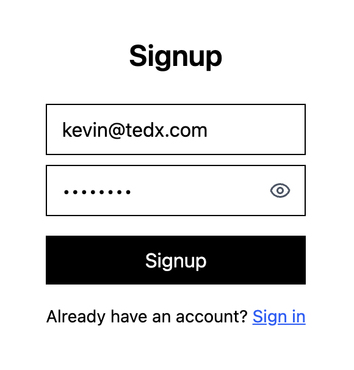
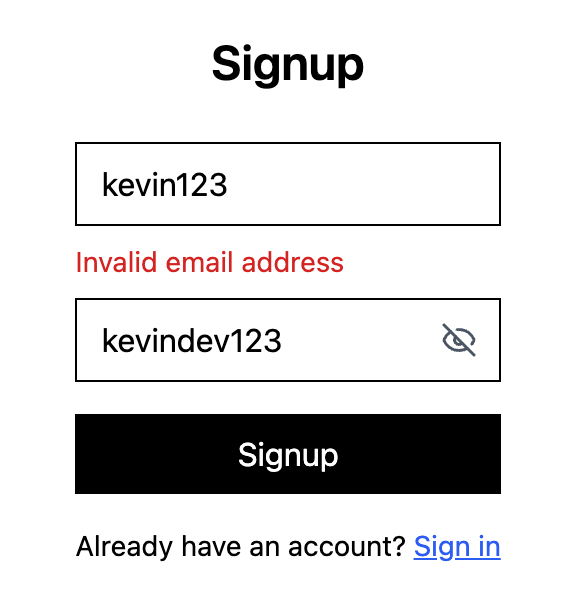
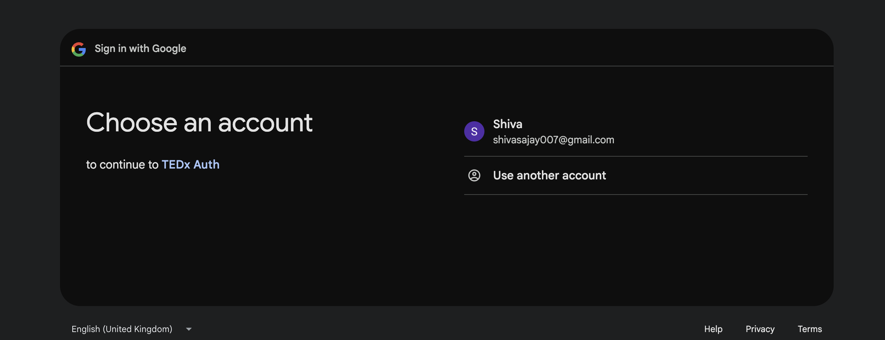
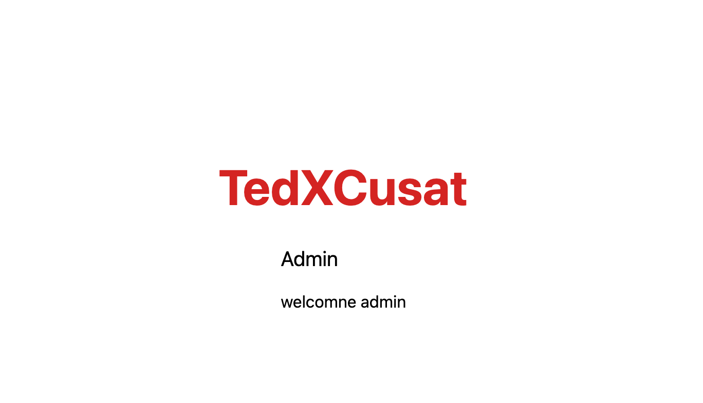
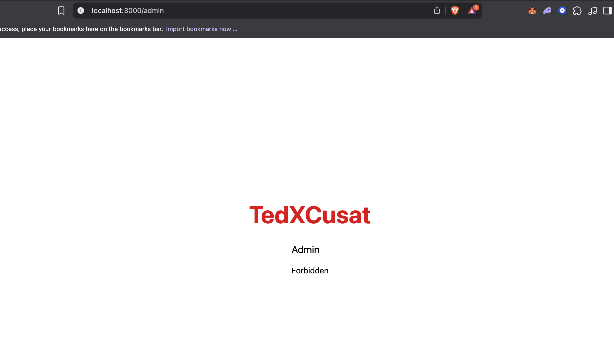
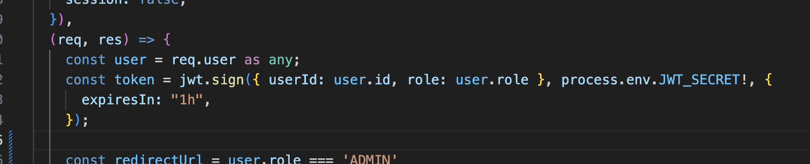

# tedx-auth api

auth api for recruitment using node + express
basic jwt based login + google oauth  
admin protected routes and role-based access

---

## stack

- backend: nodejs + express + typescript  
- database: postgres (via prisma orm)
- auth: jwt, bcrypt, express-session, passport-google-oauth20  
- frontend: next.js + tailwind  
- validation: zod

---

## features

- signup + login with JWT
- password hashing using bcrypt
- zod validation is reflected on frontend
- google oauth login (passport)
- role-based access (admin/user)
- protected dashboard route using middleware and controller
- logout by clearing localstorage
- basic frontend for testing purpose
- eye open/close lucid react icon to see/unsee password

---

## to run locally

```bash
# running backend (root)
cd auth-api
npm i
npx prisma migrate dev
npm run dev # run node in port 5001

# run frontend 
cd frontend
npm install
npm run dev # run next in port 3000


# inside root create a .env file 
DATABASE_URL=postgress database link
JWT_SECRET=random
GOOGLE_CLIENT_ID=...
GOOGLE_CLIENT_SECRET=...
GOOGLE_CALLBACK_URL=http://localhost:5001/api/auth/google/callback 

```

## Screenshots

### api calls getting reflectd in node terminal


### see or unsee password





### validation using zod ; email format and min 6 chars for the password



### user dashboard


### implemented google oauth login



---

## Workflow Diagram


## Role Based Login

### password is stored in hashed format with USER as the default Role


### There are two Admin accounts set: <admin1@gmail.com> with a password admin123 and <admin2@gmail.com> -> admin456. If successfull login it will redirect to the admin dashboard page.



### if not ; it shows forbidden in the dashboard [tested through accessing /admin endpoint through a user acc]



## Added JWT for secure auth with an expiration period of 1 hr



## Backend deployed on render: [https://tedx-auth-api-el70.onrender.com/](https://tedx-auth-api-el70.onrender.com/)


---